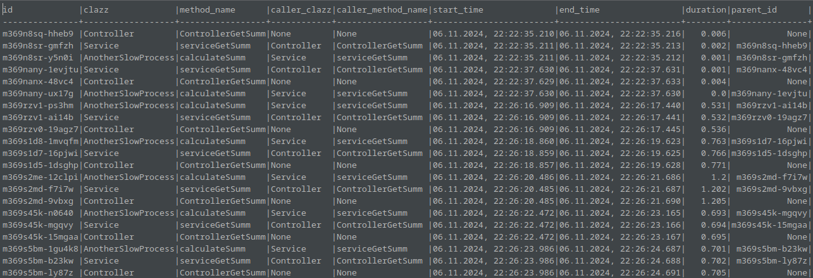

# LogAnalyzer

**LogAnalyzer** — это инструмент для ведения логов на стороне бэкенда, который использует декораторы для записи логов через несколько транспортов (консоль, SQLite). Логи записываются при выполнении методов, аннотированных специальным декоратором, и затем экспортируются в формате XML для дальнейшего анализа средствами Power BI.

## Основные возможности
- **Логирование с помощью декораторов**: Методы, аннотированные декораторами, автоматически записывают детали выполнения, такие как время выполнения, уникальные идентификаторы (UID) и информацию о вызывающем методе.
- **Мульти-транспортное логирование**: Логи могут сохраняться в консоль и SQLite для долговременного хранения и анализа.
- **Экспорт в XML**: Логи можно экспортировать в формате XML, что упрощает их импорт и анализ в Power BI или других аналитических инструментах.
- **Анализ в Power BI**: Собранные лог-данные могут быть использованы для создания детализированных отчетов и визуализаций в Power BI.

## Структура проекта
1. **Декораторы**: Кастомные декораторы обеспечивают автоматическое логирование методов, фиксируя ключевую информацию, такую как время выполнения и контекст вызова.
2. **Логгер**: Логгер поддерживает различные транспорты, включая консоль и SQLite.
3. **XML-формат**: Логи экспортируются в формате XML для легкой интеграции с аналитическими инструментами.

## Установка
1. Установите зависимости:
   ```bash
   npm install

## Пример использования
```typescript
import { TimeTrack } from "../logger/timetrack";

@injectable()
export class Service {

  @TimeTrack
  public async getSumm(a: number, b: number): Promise<number> {
     return Promise.resolve(a + b);
  }
}
```

## Результат измерений в SQLite

Позволяет хранить древовидную структуру вызовов функций, где каждая запись может ссылаться на свою родительскую запись. При удалении родительской записи все связанные с ней записи также будут удалены.



